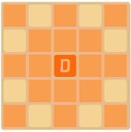

# Buffalo Chess

Moving is compulsory; it is illegal to skip a turn, even when having to move is detrimental.

# Play and Rules

## Moves

**Dog** *(as 'D')* can move any number of vacant squares diagonally, horizontally, or vertically as like [Queen](https://en.wikipedia.org/wiki/Queen_(chess)) in chess.

**Player** *(as 'P')* can move exactly one square horizontally, vertically, or diagonally as like [King](https://en.wikipedia.org/wiki/King_(chess)) in chess. Player can captured a piece of **Buffalo** *(as 'B')* and removed it.

**Buffalo** *(as 'B')* can move forward one square, if that square is unoccupied. Its movement is exactly same with  as like [Pawn](https://en.wikipedia.org/wiki/Pawn_(chess)) in chess.
In this game (not in original boardgame), Buffalo moves automatically after **Player** or **Dog** moves.

## Goal

**Close off the load** to buffaloes can NOT be arrived the bottom, with moving **Player** and **Dog** by removing buffaloes or blocking them.

## End of the game

If all buffaloes can not move, Player **Wins**

If any of buffalo arrived the bottom, Player **Loses**